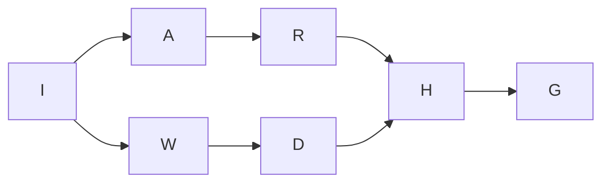
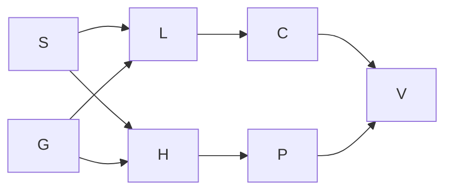
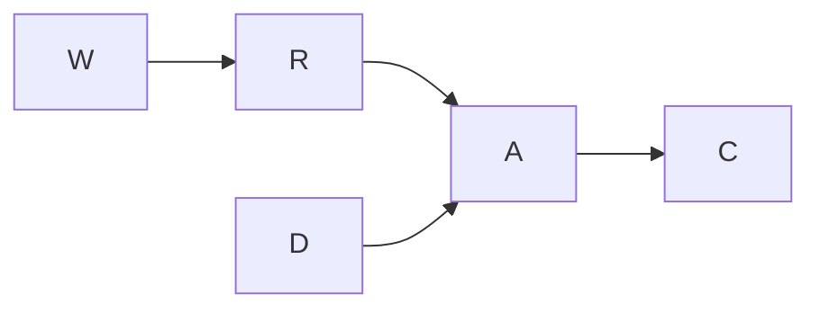
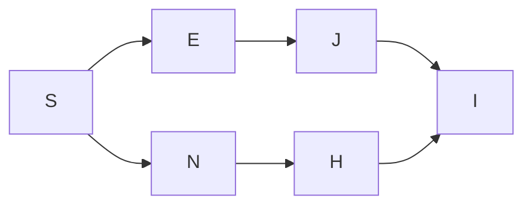
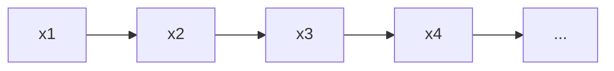
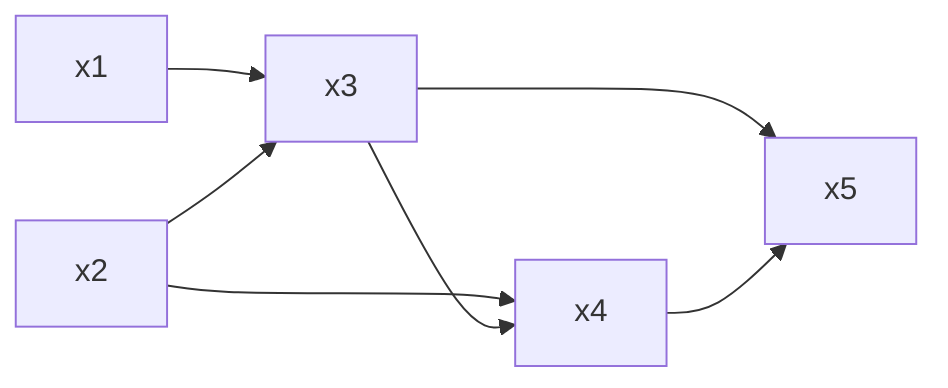
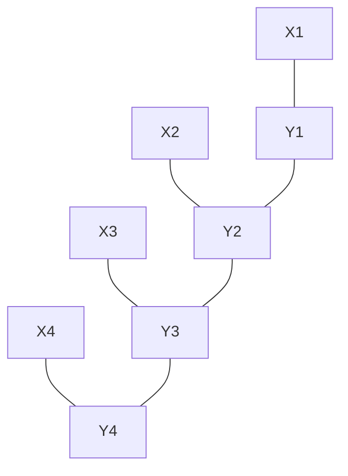

import { Highlight } from '@/components/highlight';
import { QuestionDot } from '@/components/question-dot';
import { LongQuestion } from '@/components/question';


# Module 1 — Generalized Linear Models & Exponential Family


### Q1. Explain the three core components of a GLM—random component, systematic component, and link function—and describe how they interact. <QuestionDot color="yellow" text="IA1-QB" /> <QuestionDot color="cyan" text="MSE-QB" /> <QuestionDot color="purple" text="Asked in MSE" />


A **Generalized Linear Model (GLM)** extends linear regression so that the response variable can follow distributions **other than Normal** (e.g., binary, count data).


A GLM has **three components**:


1. **Random Component**

   
   The probability distribution of the response variable $Y$, which must belong to the **exponential family** (e.g., Normal, Bernoulli, Poisson).
   $$
   Y \sim \text{Exponential Family}
   $$


2. **Systematic Component**

   
   A linear combination of input variables (the linear predictor):
   $$
   \eta = \beta_0 + \beta_1 x_1 + \cdots + \beta_p x_p = X\beta
   $$


3. **Link Function**

   
   Connects the mean $\mu = E(Y)$ to the linear predictor:
   $$
   g(\mu) = \eta
   $$
   It ensures predictions stay within valid range for the chosen distribution.


   Common link functions:
   - **Identity** ($g(\mu) = \mu$) → Linear regression
   - **Logit** ($g(\mu) = \log\frac{\mu}{1-\mu}$) → Logistic regression
   - **Log** ($g(\mu) = \log(\mu)$) → Poisson regression


**Significance:**


GLMs provide a **single framework** for modeling continuous, binary, and count data while keeping the simplicity of linear models. They are widely used in statistics, ML, and economics.


**How They Interact:**


The random component defines the distribution of $Y$ and its mean $\mu$. The link function bridges $\mu$ to the linear predictor $\eta$. The systematic component builds $\eta$ from the predictors. Together:


$$
\mathbf{X}\boldsymbol{\beta} \overset{\text{Systematic}}{\longrightarrow} \eta \overset{g^{-1}}{\longrightarrow} \mu \overset{\text{Random}}{\longrightarrow} Y
$$


---


### Q2. What is the role of the canonical link function in GLMs? Explain with an example. / What are link functions in GLMs? Why are different link functions used? / Explain link functions used in Generalized Linear Models (GLMs). Give one example distribution for its associated link function. <QuestionDot color="yellow" text="IA1-QB" /> <QuestionDot color="green" text="Asked in IA1" />


In a **Generalized Linear Model (GLM)**, a <Highlight color="blue">**link function**</Highlight> establishes a relationship between the **expected value of the response variable** and the **linear predictor**.


Mathematically, it is defined as:
$$
g(\mu) = \eta = X\beta
$$
where $\mu = E(y)$ is the mean of the response variable.


The link function transforms $\mu$ so it can be modeled as a linear combination of inputs. This is needed because many response variables have a restricted range (e.g., probabilities must be between 0 and 1).


Different distributions need different link functions:


| Link Function | Formula | Used For |
|---|---|---|
| **Identity** | $g(\mu) = \mu$ | Linear regression (no constraint) |
| **Logit** | $g(\mu) = \log\frac{\mu}{1-\mu}$ | Logistic regression ($\mu$ between 0 and 1) |
| **Log** | $g(\mu) = \log(\mu)$ | Poisson regression ($\mu > 0$) |
| **Probit** | $g(\mu) = \Phi^{-1}(\mu)$ | Binary classification ($\mu$ between 0 and 1) |


**Why are they important?**


1. They keep predictions within the **valid range** for the response variable.
2. They let us use **one GLM framework** for many data types (binary, count, continuous).
3. The **canonical link** (default for each distribution) makes parameter estimation simpler.


Thus, link functions provide <Highlight>**flexibility**</Highlight>, ensure valid predictions, and allow linear models to handle a wide variety of response variables.


---


### Q3. Explain Probit regression and provide a conceptual comparison with Logistic regression. / Compare Probit and Logistic regression in terms of their link functions, assumptions, and practical scenarios where one is preferred over the other. <QuestionDot color="yellow" text="IA1-QB" />


**Probit regression** is a GLM used for binary classification. It models probability using the **standard normal CDF**:


$$
P(y=1 \mid x,w) = \Phi(w^T x)
$$


where:
$$
\Phi(z) = \int_{-\infty}^{z} \frac{1}{\sqrt{2\pi}} e^{-t^2/2} , dt
$$


The link function is:
$$
g(\mu) = \Phi^{-1}(\mu)
$$


---


**Logistic regression** is also a GLM for binary classification. It models probability using the **sigmoid function**:


$$
P(y=1 \mid x,w) = \frac{1}{1 + e^{-w^T x}}
$$


The link function is:
$$
g(\mu) = \log\frac{\mu}{1-\mu}
$$


---


### Comparison


| Aspect        | Logistic Regression             | Probit Regression         |
| ------------- | ------------------------------- | ------------------------- |
| Link Function | Logit ($\log\frac{\mu}{1-\mu}$) | Probit ($\Phi^{-1}(\mu)$) |
| Function      | Sigmoid                         | Normal CDF                |
| Assumption    | Logistic noise                  | Gaussian (normal) noise   |


---


### Practical Scenarios


* **Logistic Regression**: Used for general binary classification problems due to simplicity
* **Probit Regression**: Used when the underlying latent variable is assumed to be normally distributed


---


### Conclusion


Both give similar results. Logistic is preferred for general use, while probit is preferred when a normality assumption is appropriate.


---


### Q4. What is multitask learning? How does parameter sharing across related tasks enhance generalization, particularly when certain tasks have scarce training data? <QuestionDot color="yellow" text="IA1-QB" /> <QuestionDot color="green" text="Asked in IA1" />


**Multitask Learning (MTL)** trains multiple related tasks **together** in a single model instead of building separate models for each task.

The core idea is <Highlight>**parameter sharing**</Highlight>, which has two types:

1. **Hard Sharing**: Tasks share the same hidden layers, only output layers are separate. Most common and reduces overfitting.
2. **Soft Sharing**: Each task has its own model, but parameters are pushed to stay similar.

**How Parameter Sharing Helps:**

1. **Knowledge Transfer**: Tasks with less data learn from tasks with more data
2. **Regularization**: Shared parameters reduce overfitting, especially for low-data tasks
3. **Better Features**: Model learns general patterns useful across all tasks
4. **Handles Scarce Data**: Low-data tasks borrow strength from high-data tasks via shared prior
5. **Better Generalization**: Leads to more stable estimates and improved performance across tasks

**Examples:**

- **NLP**: One model doing NER + POS tagging + sentiment analysis together.
- **Vision**: One model doing object detection + segmentation + depth estimation.
- **Healthcare**: Predicting readmission, mortality, and stay length from the same patient data.

**Significance:**

MTL is more data-efficient and produces more robust models than single-task learning, especially when individual tasks have limited labeled data.


**Real-World Examples:**
- Speech recognition across multiple languages
- Medical diagnosis of multiple related diseases
- NLP: sentiment analysis + emotion detection trained together


---


### Q5. 


Both Probit and Logistic regression are **GLMs for binary classification**. They differ in their choice of link function and underlying distributional assumptions.


**Link Functions:**


- **Logistic Regression:** Uses the **logit** link → $g(\mu) = \log\frac{\mu}{1-\mu}$, with inverse being the sigmoid $\sigma(\eta)$.
- **Probit Regression:** Uses the **probit** link → $g(\mu) = \Phi^{-1}(\mu)$, with inverse being the normal CDF $\Phi(\eta)$.


| Property | Logistic | Probit |
|---|---|---|
| Link function | Logit | Probit ($\Phi^{-1}$) |
| Mean function | Sigmoid $\frac{1}{1+e^{-\eta}}$ | Normal CDF $\Phi(\eta)$ |
| Tail behavior | Heavier tails | Lighter (Gaussian) tails |
| Latent variable noise | Logistic distribution | Gaussian distribution |
| Coefficient interpretation | Log-odds | Standardized normal units |
| Preferred scenario | General binary outcomes | Latent Gaussian variable assumed |


**Key Assumptions:**


- Both assume a **latent variable** $z^* = \mathbf{w}^T\mathbf{x} + \epsilon$ where $y = 1$ if $z^* > 0$.
- Logistic assumes $\epsilon \sim \text{Logistic}(0,1)$; Probit assumes $\epsilon \sim \mathcal{N}(0,1)$.


**When to Prefer Probit:**
- When the underlying process is naturally governed by **Gaussian noise** (e.g., psychometric testing, econometrics with normal latent variable).
- When integrating with **Bayesian models** (probit has a convenient conjugate prior — the normal).


**When to Prefer Logistic:**
- When **interpretability via odds ratios** is important.
- In most general binary classification tasks — it is computationally simpler and equally accurate.


---


<LongQuestion>
### Q6. (Extras for Reference/Practice) A Probit model predicts grad admission with: $\eta = -3.5 + 1.0 \cdot \text{GPA} + 0.4 \cdot \text{TopTier}$. Find $P(\text{Admit}) = \Phi(\eta)$ for: Case A: GPA = 3.0, TopTier = 0; Case B: GPA = 3.0, TopTier = 1; Case C: GPA = 4.0, TopTier = 1. <QuestionDot color="yellow" text="IA1-QB" /> <QuestionDot color="green" text="Asked in IA1" />
</LongQuestion>


**Solution:**


The probability is given by $P(\text{Admit}) = \Phi(\eta)$, where $\Phi$ is the standard normal cumulative distribution function (CDF).


**Case A: GPA = 3.0, TopTier = 0**
1. Calculate $\eta$:
   $$ \eta = -3.5 + 1.0(3.0) + 0.4(0) = -3.5 + 3.0 = -0.5 $$
2. Find probability:
   $$ P(\text{Admit}) = \Phi(-0.5) \approx 0.3085 \quad (30.85\%) $$


**Case B: GPA = 3.0, TopTier = 1**
1. Calculate $\eta$:
   $$ \eta = -3.5 + 1.0(3.0) + 0.4(1) = -3.5 + 3.0 + 0.4 = -0.1 $$
2. Find probability:
   $$ P(\text{Admit}) = \Phi(-0.1) \approx 0.4602 \quad (46.02\%) $$


**Case C: GPA = 4.0, TopTier = 1**
1. Calculate $\eta$:
   $$ \eta = -3.5 + 1.0(4.0) + 0.4(1) = -3.5 + 4.0 + 0.4 = 0.9 $$
2. Find probability:
   $$ P(\text{Admit}) = \Phi(0.9) \approx 0.8159 \quad (81.59\%) $$


---


# Module 2 — Directed Graphical Models


### Q1. What are Directed Graphical Models (Bayesian Networks)? Using a suitable real-world example, explain how they represent causal relationships and facilitate probabilistic inference. / Define Directed Graphical Models (DGMs). Explain how Bayesian Networks represent joint probability distributions. <QuestionDot color="yellow" text="IA1-QB" /> <QuestionDot color="cyan" text="MSE-QB" /> <QuestionDot color="purple" text="Asked in MSE" />


**Directed Graphical Models (DGMs)** are probabilistic models that use a **directed graph** to show dependencies between random variables. Each **node** = a variable, each **arrow** = a dependency.


A **Bayesian Network** is a DGM whose graph is a **DAG (Directed Acyclic Graph)** — no cycles.


**Graphical Structure:**


Represented as a **Directed Acyclic Graph (DAG)** where nodes are random variables and directed edges (arrows) encode direct dependencies. No cycles are allowed.


**Joint Probability Factorization:**


$$
P(X_1, X_2, \dots, X_n) = \prod_{i=1}^{n} P(X_i \mid \text{Parents}(X_i))
$$


**Real-World Example — Medical Diagnosis (Flu):**


- Flu (Y) causes Fever ($X_1$), Cough ($X_2$), Fatigue ($X_3$)
- DAG: $Y \to X_1$, $Y \to X_2$, $Y \to X_3$


$$
P(Y, X_1, X_2, X_3) = P(Y) \cdot P(X_1 \mid Y) \cdot P(X_2 \mid Y) \cdot P(X_3 \mid Y)
$$


**How It Facilitates Inference:**


- If a patient has Fever and Cough, we can compute $P(Y=1 \mid X_1=1, X_2=1)$ using Bayes' theorem.
- The graph structure tells us **which variables are relevant** — reducing computation.
- Instead of $2^4 - 1 = 15$ parameters for the full joint, this needs only **7** parameters.


**Markov Property:**


A node is **conditionally independent of all non-descendants given its parents**. This enables the compact factorization above.


---


### Q2. How do Bayesian Networks use conditional independence properties? Explain two such properties with examples. / Explain the concept of conditional independence in Directed Graphical Models with the help of graphical intuition. <QuestionDot color="yellow" text="IA1-QB" /> <QuestionDot color="cyan" text="MSE-QB" /> <QuestionDot color="purple" text="Asked in MSE" />


**Conditional independence** means two variables don't affect each other once we know a third variable:


$$
P(X, Y \mid Z) = P(X \mid Z) \cdot P(Y \mid Z) \quad \Leftrightarrow \quad X \perp Y \mid Z
$$


In Bayesian Networks, the graph structure directly encodes conditional independencies. We use **d-separation** to check: if all paths between two nodes are "blocked" by observed variables, they are conditionally independent.


**Three Basic Structures:**


**1. Chain (Serial Connection):** $A \to B \to C$


- $A \perp C \mid B$
- Observing $B$ **blocks** the path from $A$ to $C$.
- Example: Smoking → Tar deposits → Cancer. If we know about tar deposits, smoking gives no additional info about cancer.


**2. Fork (Common Cause):** $B \leftarrow A \to C$


- $B \perp C \mid A$
- Observing common cause $A$ **blocks** the path from $B$ to $C$.
- Example: Season → Rain, Season → Sprinkler. Knowing the season makes rain and sprinkler independent.


**3. Collider (Common Effect):** $A \to B \leftarrow C$


- $A \perp C$ (marginally independent), but **NOT** $A \perp C \mid B$
- Observing $B$ **opens** the path (explaining away effect).
- Example: Intelligence → Grades ← Study Hours. Knowing grades creates a dependency between intelligence and study hours.


---


### Q3. Environmental Impact Study DAG


**Given:**
- Industrial Activity (I) → Air Quality (A), Water Quality (W)
- Air Quality (A) → Respiratory Health (R)
- Water Quality (W) → Waterborne Diseases (D)
- R and D → Healthcare Demand (H)
- Healthcare Demand (H) → Government Expenditure (G)


#### (i) Directed Acyclic Graph (DAG)





Nodes: I, A, W, R, D, H, G
Edges: I→A, I→W, A→R, W→D, R→H, D→H, H→G


#### (ii) Joint Probability Factorization


Using Bayesian Network factorization (each node conditioned on its parents):


$$
P(I, A, W, R, D, H, G) = P(I) \cdot P(A \mid I) \cdot P(W \mid I) \cdot P(R \mid A) \cdot P(D \mid W) \cdot P(H \mid R, D) \cdot P(G \mid H)
$$


#### (iii) Two Conditional Independence Relations


1. **$R \perp D \mid I$** — Respiratory Health and Waterborne Diseases are conditionally independent given Industrial Activity (the common cause). Once we know industrial activity, air quality and water quality effects are separated.


2. **$A \perp W \mid I$** — Air Quality and Water Quality are conditionally independent given Industrial Activity. Knowing the level of industrial activity blocks the path between them (fork structure).


---


### Q4. Medical Diagnosis DAG


**Given:**
- Smoking (S) and Genetics (G) → Lung Disease (L)
- Smoking (S) and Genetics (G) → Heart Disease (H)
- Lung Disease (L) → Cough (C)
- Heart Disease (H) → Chest Pain (P)
- Cough (C) and Chest Pain (P) → Hospital Visit (V)


#### (i) Directed Acyclic Graph (DAG)





Nodes: S, G, L, H, C, P, V
Edges: S→L, G→L, S→H, G→H, L→C, H→P, C→V, P→V


#### (ii) Joint Probability Factorization


$$
P(S, G, L, H, C, P, V) = P(S) \cdot P(G) \cdot P(L \mid S, G) \cdot P(H \mid S, G) \cdot P(C \mid L) \cdot P(P \mid H) \cdot P(V \mid C, P)
$$


#### (iii) Two Conditional Independence Relations (d-separation)


1. **$C \perp P \mid L, H$** — Cough and Chest Pain are conditionally independent given Lung Disease and Heart Disease. Once L and H are known, their downstream effects C and P are decoupled.


2. **$S \perp G$** — Smoking and Genetics are **marginally independent** (no directed path between them; they are root nodes with no common ancestor). They are unconditionally independent.


---


### Q5. What is a Directed Gaussian Graphical Model (DGGM)? Explain the assumption of Gaussian distribution in DGGM.


A **Directed Gaussian Graphical Model (DGGM)** is a Bayesian Network (DGM) where **all random variables are continuous and follow a Gaussian distribution**. The conditional probability distributions (CPDs) are **linear Gaussian**, meaning each variable is a linear function of its parents plus Gaussian noise.


**Conditional Probability Distribution:**


Each variable $x_t$ in the graph, given its parents $x_{\text{pa}(t)}$, has the distribution:


$$
p(x_t \mid x_{\text{pa}(t)}) = \mathcal{N}\left(x_t \;\Big|\; \mu_t + \mathbf{w}_t^T x_{\text{pa}(t)},\; \sigma_t^2\right)
$$


where:
- $\mu_t$ = local mean (bias term)
- $\mathbf{w}_t$ = vector of regression coefficients (strength of parent influence)
- $\sigma_t^2$ = conditional variance (noise level)


**Matrix-Vector Form:**


The entire system can be written as:
$$
x - \mu = W(x - \mu) + Sz, \quad z \sim \mathcal{N}(0, I)
$$


where $W$ is the weight matrix and $S = \text{diag}(\sigma_1, \dots, \sigma_D)$.


**The Gaussian Assumption:**


The key property: multiplying all Gaussian CPDs together gives a **single joint multivariate Gaussian**:


$$
p(\mathbf{x}) = \mathcal{N}(\mathbf{x} \mid \boldsymbol{\mu}, \boldsymbol{\Sigma})
$$


This means:
- **Global mean** $\boldsymbol{\mu}$ is the concatenation of local means $[\mu_1, \mu_2, \dots, \mu_D]$.
- **Global covariance** $\boldsymbol{\Sigma}$ is derived from the weight matrix and noise variances.
- Inference and learning become **analytically tractable** — closed-form solutions exist.
- Conditional distributions are also Gaussian, making downstream computations efficient.


The Gaussian assumption enables the DGGM to represent **linear causal relationships with additive noise**, widely used in structural equation models, signal processing, and econometrics.


---


<LongQuestion>
### Q6. (Extras for Reference/Practice) Define the term "inference" in the context of probabilistic graphical models. List two common inference algorithms used in Bayesian Networks. <QuestionDot color="yellow" text="IA1-QB" /> <QuestionDot color="green" text="Asked in IA1" />
</LongQuestion>


**Inference** in probabilistic graphical models refers to the process of computing the posterior distribution of one or more hidden variables given the values of some observed variables (evidence). It answers queries like $P(\text{Hidden} \mid \text{Observed})$.


**Two common inference algorithms used in Bayesian Networks:**
1. **Variable Elimination**: An exact inference algorithm that computes marginal probabilities by systematically summing out (marginalizing) unobserved variables one by one.
2. **Belief Propagation (Message Passing)**: An exact inference algorithm for tree-structured graphs (and approximate for general graphs via Loopy Belief Propagation) that works by passing local messages between nodes.


*(Other acceptable answers: Junction Tree Algorithm, Monte Carlo methods like Gibbs Sampling or Metropolis-Hastings).*


---


<LongQuestion>
### Q7. (Extras for Reference/Practice) Differentiate between Maximum Likelihood Estimation (MLE) and Bayesian Estimation for learning parameters in a directed graphical model. <QuestionDot color="yellow" text="IA1-QB" /> <QuestionDot color="green" text="Asked in IA1" />
</LongQuestion>


| Feature | Maximum Likelihood Estimation (MLE) | Bayesian Estimation |
|---|---|---|
| **Objective** | Finds a single set of parameters $\theta$ that maximizes the likelihood of the observed data: $\hat{\theta} = \arg\max_\theta P(\mathcal{D} \mid \theta)$ | Computes a full posterior distribution over parameters using Bayes' theorem: $P(\theta \mid \mathcal{D}) \propto P(\mathcal{D} \mid \theta) P(\theta)$ |
| **Prior Knowledge** | Does not use any prior knowledge (assumes uniform prior over all parameters). | Incorporates prior beliefs about the parameters via a prior distribution $P(\theta)$. |
| **Data Requirements**| Tends to overfit when data is sparse (e.g., assigning 0 probability to unseen events). | More robust to sparse data due to the regularizing effect of the prior (e.g., using Laplace smoothing/Dirichlet priors). |
| **Output** | A single point estimate (fixed values for CPDs). | A probability distribution, though often summarized by the MAP (Maximum A Posteriori) or posterior mean estimate. |
| **Complexity** | Computationally simpler; often just involves counting frequencies in the dataset. | Computationally more intensive, often requiring approximations or sampling (MCMC) for complex models. |


---


<LongQuestion>
### Q8. (Extras for Reference/Practice) For the following system: Weather (W) affects Road Condition (R), Road Condition (R) affects Accident (A), Driver Alertness (D) affects Accident (A), Accident (A) affects Insurance Claim (C). Construct a Bayesian Network (DAG) and write the joint probability distribution. <QuestionDot color="yellow" text="IA1-QB" /> <QuestionDot color="green" text="Asked in IA1" />
</LongQuestion>


**1. Directed Acyclic Graph (DAG)**





Nodes: $W, R, D, A, C$  
Edges: $W \to R$, $R \to A$, $D \to A$, $A \to C$


**2. Joint Probability Distribution**


Using the chain rule for Bayesian Networks (each node depends only on its direct parents):


$$
P(W, R, D, A, C) = P(W) \cdot P(D) \cdot P(R \mid W) \cdot P(A \mid R, D) \cdot P(C \mid A)
$$


---


<LongQuestion>
### Q9. (Extras for Reference/Practice) For the given relations: Socioeconomic Status (S) affects Education Level (E) and Nutrition (N); Education Level (E) affects Job Type (J); Nutrition (N) affects Health Condition (H); Job Type (J) and Health Condition (H) affect Income (I). Draw the DAG, write the joint probability, and write three conditional independence relations. <QuestionDot color="yellow" text="IA1-QB" /> <QuestionDot color="cyan" text="MSE-QB" /> <QuestionDot color="purple" text="Asked in MSE" />
</LongQuestion>


**1. Directed Acyclic Graph (DAG)**





Nodes: $S, E, N, J, H, I$  
Edges: $S \to E$, $S \to N$, $E \to J$, $N \to H$, $J \to I$, $H \to I$


**2. Joint Probability Distribution**


$$
P(S, E, N, J, H, I) = P(S) \cdot P(E \mid S) \cdot P(N \mid S) \cdot P(J \mid E) \cdot P(H \mid N) \cdot P(I \mid J, H)
$$


**3. Three Conditional Independence Relations**


1. **$E \perp N \mid S$**: Education and Nutrition are conditionally independent given Socioeconomic Status (Fork structure at $S$).
2. **$J \perp H \mid \{E, N\}$**: Job Type and Health Condition are conditionally independent given Education and Nutrition (Chain structures from $E$ and $N$).
3. **$J \perp S \mid E$**: Job Type is conditionally independent of Socioeconomic Status given Education Level (Chain structure $S \to E \to J$).


---


# Module 3 — Mixture Models & EM Algorithm


### Q1. Derive the Maximum Likelihood Estimates for the mean $\mu$ and variance $\sigma^2$ of a univariate Gaussian distribution given i.i.d. samples.


Given $N$ i.i.d. samples $\{y_1, y_2, \dots, y_N\}$ from $\mathcal{N}(\mu, \sigma^2)$.


**Step 1: Write the Likelihood**


$$
p(\mathbf{y} \mid \mu, \sigma^2) = \prod_{i=1}^{N} \frac{1}{\sqrt{2\pi\sigma^2}} \exp\left(-\frac{(y_i - \mu)^2}{2\sigma^2}\right)
$$


**Step 2: Log-Likelihood**


$$
\ell(\mu, \sigma^2) = -\frac{N}{2}\log(2\pi) - \frac{N}{2}\log(\sigma^2) - \frac{1}{2\sigma^2}\sum_{i=1}^{N}(y_i - \mu)^2
$$


**Step 3: MLE for $\mu$**


Take derivative with respect to $\mu$ and set to zero:


$$
\frac{\partial \ell}{\partial \mu} = \frac{1}{\sigma^2}\sum_{i=1}^{N}(y_i - \mu) = 0
$$


$$
\boxed{\hat{\mu}_{\text{MLE}} = \frac{1}{N}\sum_{i=1}^{N} y_i}
$$


The MLE for $\mu$ is the **sample mean**.


**Step 4: MLE for $\sigma^2$**


Take derivative with respect to $\sigma^2$ and set to zero:


$$
\frac{\partial \ell}{\partial \sigma^2} = -\frac{N}{2\sigma^2} + \frac{1}{2\sigma^4}\sum_{i=1}^{N}(y_i - \mu)^2 = 0
$$


$$
\boxed{\hat{\sigma}^2_{\text{MLE}} = \frac{1}{N}\sum_{i=1}^{N}(y_i - \hat{\mu})^2}
$$


The MLE for $\sigma^2$ is the **sample variance** (note: biased estimator — uses $N$ not $N-1$).


---


### Q2. What is a Gaussian Mixture Model (GMM)? Write the probability density function for a GMM with K components. <QuestionDot color="cyan" text="MSE-QB" />


A **Gaussian Mixture Model (GMM)** is a probabilistic model that represents data as a **combination of multiple Gaussian distributions**. It performs **soft clustering** — each data point has a probability of belonging to each cluster rather than a hard assignment.


The overall probability density function for a GMM with $K$ components is:


$$
p(\mathbf{x}) = \sum_{k=1}^{K} \pi_k \, \mathcal{N}(\mathbf{x} \mid \boldsymbol{\mu}_k, \boldsymbol{\Sigma}_k)
$$


Where:
- $K$ = number of Gaussian components
- $\pi_k$ = **mixing coefficient** (weight of component $k$), with $\sum_{k=1}^{K} \pi_k = 1$ and $0 \le \pi_k \le 1$
- $\boldsymbol{\mu}_k$ = mean of the $k$-th Gaussian
- $\boldsymbol{\Sigma}_k$ = covariance matrix of the $k$-th Gaussian
- $\mathcal{N}(\mathbf{x} \mid \boldsymbol{\mu}_k, \boldsymbol{\Sigma}_k)$ = Gaussian PDF for component $k$


**Generative Process:**


1. Choose a hidden component $z_i \sim \text{Categorical}(\pi_1, \dots, \pi_K)$
2. Generate data $x_i \sim p(x_i \mid z_i = k) = \mathcal{N}(\mathbf{x} \mid \boldsymbol{\mu}_k, \boldsymbol{\Sigma}_k)$


The latent variable $z_i$ indicates which Gaussian generated data point $x_i$. Since $z_i$ is **hidden**, direct MLE is intractable — the EM algorithm is used for parameter estimation.


---


### Q3. Outline the two principal steps of the EM algorithm. Why are these steps crucial for parameter estimation with latent variables? / Describe the two main steps in parameter estimation for mixture models. Explain what makes this estimation challenging when the component labels are unknown. <QuestionDot color="cyan" text="MSE-QB" /> <QuestionDot color="purple" text="Asked in MSE" />


The **Expectation-Maximization (EM) Algorithm** is an iterative method for maximum likelihood estimation when data has **latent (hidden) variables**.


**Two Principal Steps:**


**E-Step (Expectation):**


Compute the **responsibility** $\gamma_{nk}$ — the posterior probability that data point $x_n$ belongs to component $k$, given current parameters $\theta^{\text{old}}$:


$$
\gamma_{nk} = \frac{\pi_k \, \mathcal{N}(x_n \mid \mu_k, \Sigma_k)}{\sum_{j=1}^{K} \pi_j \, \mathcal{N}(x_n \mid \mu_j, \Sigma_j)}
$$


- Uses current parameter values to assign **soft probabilities** (not hard labels).
- Computes the **expected complete-data log-likelihood** $Q(\theta, \theta^{\text{old}})$.


**M-Step (Maximization):**


Update parameters by maximizing $Q(\theta, \theta^{\text{old}})$ using the responsibilities:


$$
N_k = \sum_{n=1}^{N} \gamma_{nk}, \quad \hat{\mu}_k = \frac{1}{N_k}\sum_{n=1}^{N} \gamma_{nk} x_n
$$
$$
\hat{\Sigma}_k = \frac{1}{N_k}\sum_{n=1}^{N} \gamma_{nk}(x_n - \hat{\mu}_k)(x_n - \hat{\mu}_k)^T, \quad \hat{\pi}_k = \frac{N_k}{N}
$$


**Why These Steps Are Crucial:**


- With **known** cluster labels $Z$, MLE is straightforward (just compute sample statistics per cluster).
- With **hidden** $Z$, the log-likelihood $\log \sum_k \pi_k \mathcal{N}(x \mid \mu_k, \Sigma_k)$ is **non-convex** — direct optimization fails.
- The E-step estimates the missing information; the M-step uses it as if it were observed.
- EM guarantees the **likelihood never decreases** at each iteration, converging to a local optimum.


---


### Q4. Write the mathematical expression for a mixture model with K components. For customer purchase amounts showing two distinct patterns (small vs large), analyze the suitability of Gaussian, Poisson, and Binomial distributions. Justify your choice. / Define a mixture model. You are given a dataset of customer purchase amounts. Some customers make small purchases, while others make large purchases. Apply the GLM framework to decide which distribution (Gaussian, Poisson, or Binomial) would be appropriate for modeling this data. Justify your choice. <QuestionDot color="cyan" text="MSE-QB" /> <QuestionDot color="purple" text="Asked in MSE" />


**Mixture Model with K Components:**


$$
p(x) = \sum_{k=1}^{K} \pi_k \, p(x \mid \theta_k)
$$


where:
- $K$ = number of components
- $\pi_k$ = mixing coefficient, $\sum_{k=1}^{K} \pi_k = 1$, $0 \le \pi_k \le 1$
- $p(x \mid \theta_k)$ = component distribution with parameters $\theta_k$


**Analysis for Customer Purchase Amounts:**


**Appropriate Distribution: Gaussian (Normal)**


Purchase amount is **continuous data** (e.g., ₹10.50, ₹120.75), so Gaussian distribution is suitable.


The data shows **two groups of customers**:
- Small spenders (cluster 1)
- Large spenders (cluster 2)


This is modeled as a **Gaussian Mixture Model** with $K = 2$:


$$
p(x) = \pi_1 \, \mathcal{N}(x \mid \mu_1, \sigma_1^2) + \pi_2 \, \mathcal{N}(x \mid \mu_2, \sigma_2^2)
$$


**Poisson distribution** is **not suitable** because it models **count data** (like number of items bought, number of events), not continuous monetary amounts.


**Binomial distribution** is **not suitable** because it models **yes/no or success/failure** type data (like whether a customer bought or not), not purchase amounts.


---


### Q5. Explain the E-step and M-step of the EM algorithm in detail. Why is the algorithm guaranteed to converge to a local optimum? <QuestionDot color="cyan" text="MSE-QB" />


*(See Q3 and Q7 above for the E-step and M-step detail. Extended answer below.)*


**E-Step in Detail:**


Compute the **expected complete-data log-likelihood** $Q(\theta, \theta^{t-1})$:


$$
Q(\theta, \theta^{t-1}) = \mathbb{E}_{Z \mid X, \theta^{t-1}}\left[\log p(X, Z \mid \theta)\right]
$$


This involves computing the **responsibilities** (posterior probabilities):
$$
\gamma_{nk} = \frac{\pi_k \, \mathcal{N}(x_n \mid \mu_k, \Sigma_k)}{\sum_{j=1}^{K} \pi_j \, \mathcal{N}(x_n \mid \mu_j, \Sigma_j)}
$$


$\gamma_{nk}$ gives a **soft assignment** — each data point belongs to all clusters with some probability.


**M-Step in Detail:**


Maximize $Q(\theta, \theta^{t-1})$ to obtain updated $\theta^t$:


$$
N_k = \sum_{n=1}^{N} \gamma_{nk}
$$
$$
\hat{\mu}_k = \frac{1}{N_k}\sum_{n=1}^{N} \gamma_{nk} x_n, \quad \hat{\Sigma}_k = \frac{1}{N_k}\sum_{n=1}^{N} \gamma_{nk}(x_n - \hat{\mu}_k)(x_n - \hat{\mu}_k)^T, \quad \hat{\pi}_k = \frac{N_k}{N}
$$


**Why EM Converges to a Local Optimum:**


1. **Monotonic Likelihood Increase:** At each iteration, $\log p(X \mid \theta^t) \ge \log p(X \mid \theta^{t-1})$. The likelihood never decreases.
2. **Jensen's Inequality:** The E-step constructs a lower bound (the $Q$ function) on the log-likelihood. The M-step maximizes this bound.
3. **Bounded Above:** The log-likelihood is bounded above (probabilities $\le 1$).
4. Together: a non-decreasing, bounded sequence must **converge**.


EM finds a **local optimum** (not necessarily global) because the likelihood surface is non-convex with multiple modes. Initialization matters.


---


### Q6. Compare GLMs with Generalized Linear Mixed Models (GLMMs). Highlight key differences in model structure, handling of random effects, and appropriate application scenarios.


**Generalized Linear Models (GLMs)** model the expected value of $Y$ as a function of fixed predictors only:


$$
g(E[Y \mid X]) = X\beta
$$


**Generalized Linear Mixed Models (GLMMs)** extend GLMs by adding **random effects** $b$ to account for group-level variation:


$$
g(E[Y \mid X, b]) = X\beta + Zb, \quad b \sim \mathcal{N}(0, \Psi)
$$


where $Z$ is the design matrix for random effects and $\Psi$ is the covariance of random effects.


| Aspect | GLM | GLMM |
|---|---|---|
| Model Structure | Fixed effects only: $g(\mu) = X\beta$ | Fixed + Random effects: $g(\mu) = X\beta + Zb$ |
| Random Effects | None | Included; $b \sim \mathcal{N}(0, \Psi)$ |
| Data Assumption | Independent observations | Grouped / clustered / repeated measures |
| Parameter Estimation | MLE (analytically tractable) | MLE/REML (requires numerical integration) |
| Inference | Population-level (marginal) | Subject-level (conditional) |
| Application | Independent samples | Hierarchical, longitudinal, repeated measures |


**When to Use GLMMs:**


- Students nested in schools (schools are random effects)
- Repeated measurements on the same patient
- Multi-task learning with group-specific parameters $\theta_j \sim \mathcal{N}(\mu, \sigma^2 I)$
- Any scenario with **non-independence** due to grouping


In the hierarchical Bayesian view, GLMMs are equivalent to multi-task learning: each group $j$ has its own $\theta_j$, but they are drawn from a shared prior, enabling **information borrowing** across groups with scarce data.


---


# Module 4 — Markov Chains & Hidden Markov Models


### Q1. State the Markov property for a first-order Markov chain. For a second-order Markov chain, write the expression for computing the probability of a sequence and draw a diagram illustrating the dependencies.


**First-Order Markov Property:**


The future state depends only on the **current state**, not on any earlier history:


$$
P(x_t \mid x_{t-1}, x_{t-2}, \dots, x_1) = P(x_t \mid x_{t-1})
$$


The joint probability of a sequence $x_1, x_2, \dots, x_T$ factorizes as:


$$
P(x_1, x_2, \dots, x_T) = P(x_1) \prod_{t=2}^{T} P(x_t \mid x_{t-1})
$$


**Diagram (First-Order):**



---


**Second-Order Markov Chain:**


The current state depends on the **last two states**:


$$
P(x_t \mid x_{t-1}, x_{t-2}, \dots, x_1) = P(x_t \mid x_{t-1}, x_{t-2})
$$


The joint probability of a sequence is:


$$
P(x_1, \dots, x_T) = P(x_1) \cdot P(x_2 \mid x_1) \cdot \prod_{t=3}^{T} P(x_t \mid x_{t-1}, x_{t-2})
$$


**Diagram (Second-Order):**

Each node $x_t$ has **two parents**: $x_{t-1}$ and $x_{t-2}$.


**Limitation:** Higher-order models increase the number of parameters exponentially. An alternative is to use a **Hidden Markov Model (HMM)**, which captures long-range dependencies through a latent first-order Markov chain.


---


### Q2. Define transition probabilities and emission probabilities in HMMs. Explain their significance.


An **HMM** is defined by parameters $\lambda = (A, B, \pi)$ governing a two-layer model: a hidden Markov chain and observable emissions.


**Transition Probabilities ($A$):**


$$
a_{ij} = P(q_{t+1} = S_j \mid q_t = S_i)
$$


- $a_{ij}$ is the probability of transitioning from hidden state $S_i$ to $S_j$.
- **Properties:** $a_{ij} \ge 0$ and $\sum_{j=1}^{N} a_{ij} = 1$ for each state $S_i$.
- Organized as an $N \times N$ **transition matrix** $A$.


**Significance:** Captures the **temporal dynamics** of the hidden process — how the system evolves over time.


**Emission Probabilities ($B$):**


$$
b_{jm} = P(O_t = v_m \mid q_t = S_j)
$$


- $b_{jm}$ is the probability of observing symbol $v_m$ when in hidden state $S_j$.
- **Properties:** $b_{jm} \ge 0$ and $\sum_{m=1}^{M} b_{jm} = 1$ for each state $S_j$.
- Organized as an $N \times M$ **emission matrix** $B$.


**Significance:** Links the **hidden states to observable outputs** — allows inference of hidden causes from observed data.


**Together** $(A, B, \pi)$:


| Parameter | Meaning |
|---|---|
| $\pi_i$ | Initial state probability $P(q_1 = S_i)$ |
| $A$ | How hidden states evolve over time |
| $B$ | What observations each hidden state generates |


---


### Q3. List and briefly describe the three fundamental problems that HMMs address, along with the standard algorithms used to solve each.


When given only an observed sequence $O = O_1, O_2, \dots, O_T$, HMMs address three fundamental problems:


**A. Evaluation (Likelihood)**


- **Problem:** What is the probability $P(O \mid \lambda)$ that the observed sequence was generated by the model?
- **Challenge:** Summing over all $N^T$ possible hidden state sequences is computationally infeasible.
- **Algorithm:** **Forward Algorithm** — uses dynamic programming to efficiently compute $P(O \mid \lambda)$ in $O(N^2 T)$ time.


**B. Decoding (Most Likely Hidden Sequence)**


- **Problem:** What is the most likely hidden state sequence $Q^* = \arg\max_Q P(Q \mid O, \lambda)$ that explains the observed data?
- **Algorithm:** **Viterbi Algorithm** — uses dynamic programming with maximization instead of summation; finds the optimal path in $O(N^2 T)$ time.


**C. Learning (Parameter Estimation)**


- **Problem:** How do we estimate model parameters $\lambda = (A, B, \pi)$ from observed data alone?
- **Challenge:** Hidden state sequences are unobserved; direct counting is impossible.
- **Algorithm:** **Baum-Welch Algorithm** (a form of EM) — E-step computes expected counts via Forward-Backward; M-step re-estimates parameters. Iterates until convergence.


| Problem | Question | Algorithm |
|---|---|---|
| Evaluation | $P(O \mid \lambda) = ?$ | Forward Algorithm |
| Decoding | $\arg\max_Q P(Q \mid O, \lambda) = ?$ | Viterbi Algorithm |
| Learning | $\arg\max_\lambda P(O \mid \lambda) = ?$ | Baum-Welch (EM) |


---


### Q4. Define the forward variable $\alpha_t(i)$ for an HMM. Provide the initialization, recursion, and termination steps of the Forward Algorithm with mathematical expressions.


**Forward Variable:**


$$
\alpha_t(i) = P(O_1, O_2, \dots, O_t, q_t = S_i \mid \lambda)
$$


This is the probability of **observing the first $t$ symbols** $O_1, \dots, O_t$ **and** being in state $S_i$ at time $t$, given the model $\lambda$.


**Forward Algorithm Steps:**


**Initialization** ($t = 1$):


$$
\alpha_1(i) = \pi_i \cdot b_i(O_1), \quad 1 \le i \le N
$$


- $\pi_i$: initial probability of starting in state $S_i$
- $b_i(O_1)$: probability of emitting $O_1$ from state $S_i$


**Recursion** ($t = 2, 3, \dots, T$):


$$
\alpha_t(j) = \left[\sum_{i=1}^{N} \alpha_{t-1}(i) \cdot a_{ij}\right] \cdot b_j(O_t)
$$


- Sum over all previous states $S_i$: probability of being in $S_i$ at $t-1$ and transitioning to $S_j$
- Multiply by emission probability $b_j(O_t)$ for the current observation


**Termination:**


$$
P(O \mid \lambda) = \sum_{i=1}^{N} \alpha_T(i)
$$


- Sum the forward probabilities at the final time step over all states.


**Complexity:** $O(N^2 T)$ — much more efficient than the naive $O(N^T)$ brute-force summation.


---


# Module 5 — Undirected Graphical Models


### Q1. Apply conditional independence to an undirected graphical model (Markov Random Field). Using a simple chain structure A-B-C, write the factorization of the joint probability distribution and explain the conditional independence property that holds.


**Markov Random Fields (MRFs)** encode conditional independence through **graph separation**: two variables are conditionally independent if removing a set of observed nodes disconnects their paths.


**Chain Structure: A — B — C**


**Joint Probability Factorization:**


Using the **Hammersley-Clifford theorem**, the joint distribution factorizes over **maximal cliques**. In a chain, the maximal cliques are $\{A, B\}$ and $\{B, C\}$:


$$
P(A, B, C) = \frac{1}{Z} \psi_{AB}(A, B) \cdot \psi_{BC}(B, C)
$$


where:
- $\psi_{AB}(A, B)$ = potential function over clique $\{A, B\}$ — captures compatibility between A and B
- $\psi_{BC}(B, C)$ = potential function over clique $\{B, C\}$
- $Z = \sum_{A,B,C} \psi_{AB}(A,B) \cdot \psi_{BC}(B,C)$ = partition function (normalization constant)


**Conditional Independence Property:**


In the chain A — B — C:
- **Pairwise:** A and C are not directly connected → $A \perp C \mid \{B, \text{all others}\}$
- **Global (Graph Separation):** Node B separates A from C → $A \perp C \mid B$


$$
P(A, C \mid B) = P(A \mid B) \cdot P(C \mid B)
$$


This is the **global Markov property**: once B is observed, A and C become independent — B "blocks" all information flow between them.


---


### Q2. Draw a simple CRF diagram for sequence labeling and explain the purpose of node factors and edge factors.


A **Conditional Random Field (CRF)** is an undirected probabilistic graphical model that models $P(Y \mid X)$ — the conditional distribution of output labels $Y$ given observed input $X$.


**Linear-Chain CRF for Sequence Labeling:**





The conditional distribution is:


$$
P(Y \mid X) = \frac{1}{Z(X)} \prod_{t=1}^{T} \phi_{\text{node}}(Y_t, X, t) \cdot \prod_{t=1}^{T-1} \phi_{\text{edge}}(Y_t, Y_{t+1}, X, t)
$$


**Node Factors $\phi_{\text{node}}(Y_t, X, t)$:**


- Also called **unary potentials**.
- Capture the compatibility of **label $Y_t$ with the input $X$ at position $t$**.
- Example: In NER, the node factor scores how likely "New" is a B-LOC tag given surrounding words.
- Encode local, position-specific evidence.


**Edge Factors $\phi_{\text{edge}}(Y_t, Y_{t+1}, X, t)$:**


- Also called **pairwise potentials**.
- Capture **label-to-label transitions** between adjacent positions, conditioned on $X$.
- Example: Penalize unlikely transitions like I-ORG following B-PER.
- Encode **sequential consistency** of label assignments.


**Key advantage:** Both factors can depend on the **entire input sequence $X$**, unlike HMMs where only local context is used. This allows rich, overlapping features.


---


### Q3. Compare CRFs and HMMs for sequence labeling. Explain their key training and inference differences with examples.


Both HMMs and CRFs are used for sequence labeling (e.g., POS tagging, Named Entity Recognition), but they differ fundamentally in their modeling philosophy.


| Aspect | HMM | CRF |
|---|---|---|
| Model Type | Generative: models $P(X, Y)$ | Discriminative: models $P(Y \mid X)$ |
| Joint/Conditional | Joint distribution | Conditional distribution |
| Independence Assumption | Observations independent given state | No strong independence assumptions |
| Feature Flexibility | Limited: local emission features only | Rich, overlapping, arbitrary features of $X$ |
| Label Bias | Susceptible to label bias | Circumvents label bias |
| Training | MLE on joint $P(X, Y)$ via Baum-Welch | Maximize conditional log-likelihood |
| Inference | Forward/Viterbi algorithms | Forward-backward / Viterbi (chains) |
| Parameters | Transition $A$, Emission $B$, Initial $\pi$ | Feature weights $\lambda_k$ |


**Training Differences:**


- **HMM:** Uses **Baum-Welch (EM)** — estimates $P(X, Y)$; requires modeling the observations (generative).
- **CRF:** Maximizes $\sum_m \log P(Y^m \mid X^m)$ — only models labels given observations (discriminative). Uses gradient-based optimization; requires computing partition function $Z(X)$.


**Inference Differences:**


- **Both** use the **Viterbi algorithm** for decoding the most likely label sequence.
- **HMM** forward algorithm computes $P(X)$; **CRF** forward-backward computes $P(Y_t \mid X)$.


**Example — NER:**


- HMM must model $P(\text{"Barack"} \mid \text{B-PER})$ — the emission probability of a word given a tag.
- CRF can use features like: is the word capitalized? does it appear in a gazetteer? what are the surrounding words? — far more expressive.


---


### Q4. Define Markov Random Fields. Write the mathematical formula for Markov Random Fields.


A **Markov Random Field (MRF)**, also called an **Undirected Graphical Model (UGM)**, is a probabilistic model that represents the joint distribution of a set of random variables using an **undirected graph** $G = (V, E)$.


- **Nodes** $V$: random variables $X_1, X_2, \dots, X_n$
- **Edges** $E$: undirected, encoding symmetric dependencies
- **No edge** between two nodes implies a form of **conditional independence**


**Mathematical Formula:**


The joint distribution factorizes over the **maximal cliques** $\mathcal{C}$ of the graph:


$$
P(X_1, X_2, \dots, X_n) = \frac{1}{Z} \prod_{C \in \mathcal{C}} \psi_C(X_C)
$$


where:
- $\psi_C(X_C) \ge 0$ = **potential function** (also called clique potential) over clique $C$
- $Z = \sum_{\mathbf{X}} \prod_{C} \psi_C(X_C)$ = **partition function** (normalization constant)


**Log-Linear (Exponential Family) Form:**


$$
P(\mathbf{X}) = \frac{1}{Z} \exp\left(\sum_k \lambda_k f_k(X_{C_k})\right)
$$


where $f_k$ are feature functions and $\lambda_k$ are learned weights.


**Three Markov Properties:**


| Property | Statement |
|---|---|
| Pairwise | $(i,j) \notin E \Rightarrow X_i \perp X_j \mid X_{V \setminus \{i,j\}}$ |
| Local | $X_i \perp X_{V \setminus \text{nb}(i)} \mid X_{\text{nb}(i)}$ |
| Global | $\text{sep}_G(A, B \mid S) \Rightarrow A \perp B \mid S$ |


---


### Q5. Explain Conditional Random Fields (CRFs). Why are they used in sequence modeling?


A **Conditional Random Field (CRF)** is an **undirected probabilistic graphical model** that directly models the **conditional distribution** $P(Y \mid X)$ over output variables $Y$ given observed inputs $X$.


**Formal Definition:**


Let $G = (V, E)$ be an undirected graph over output variables $Y = \{Y_1, \dots, Y_n\}$. A CRF defines:


$$
P(Y \mid X) = \frac{1}{Z(X)} \prod_{C \in \mathcal{C}} \psi_C(Y_C, X)
$$


In **log-linear form**:


$$
P(Y \mid X) = \frac{1}{Z(X)} \exp\left(\sum_k \lambda_k f_k(Y_{C_k}, X)\right)
$$


where:
- $f_k(Y_{C_k}, X)$ = feature functions (can depend on **entire input** $X$)
- $\lambda_k$ = learned weights
- $Z(X) = \sum_Y \exp\left(\sum_k \lambda_k f_k(Y_{C_k}, X)\right)$ = input-dependent partition function


**Why CRFs Are Used in Sequence Modeling:**


1. **Discriminative:** Directly models $P(Y \mid X)$ without needing to model $P(X)$ — more efficient for prediction tasks.


2. **Rich features:** Feature functions $f_k$ can capture **arbitrary, overlapping properties** of the entire input sequence (e.g., word shape, prefix, context window) — far more expressive than HMMs.


3. **No label bias:** Unlike HMMs, CRFs are not affected by the **label bias problem** (where local normalization causes certain transitions to be preferred regardless of observations).


4. **Efficient inference:** For linear-chain CRFs, exact inference is possible via **Viterbi** (MAP) and **Forward-Backward** (marginals) in $O(N^2 T)$.


5. **Applications:** POS tagging, Named Entity Recognition (NER), chunking, image segmentation, gene prediction.


---


# Module 6 — Monte Carlo Inference


### Q1. What is Monte Carlo Inference? Why are Monte Carlo methods used in probabilistic models?


**Monte Carlo Inference** is a class of computational methods that use **random sampling** to approximate intractable integrals and expectations in probabilistic models.


**Core Idea:**


Instead of computing $\mathbb{E}_p[f(x)] = \int f(x) p(x)\, dx$ analytically, approximate it using $N$ random samples $x_i \sim p(x)$:


$$
\mathbb{E}_p[f(x)] \approx \frac{1}{N} \sum_{i=1}^{N} f(x_i)
$$


By the **Law of Large Numbers**, this estimator converges to the true expectation as $N \to \infty$.


**Why Monte Carlo Methods Are Used:**


Many quantities in probabilistic models require computing integrals that are **analytically intractable**:


1. **High-dimensional integrals:** Posterior distributions $p(\theta \mid \mathcal{D}) \propto p(\mathcal{D} \mid \theta) p(\theta)$ involve normalizing constants that cannot be computed in closed form.


2. **Complex distributions:** Mixture models, Bayesian networks, and MRFs define distributions with intractable partition functions.


3. **Missing data / latent variables:** Marginalizing over hidden variables requires summing/integrating over exponentially many configurations.


**Advantages:**
- Works in **high dimensions** where quadrature fails.
- **Simple and flexible** — applicable to any distribution from which we can sample.
- Provides estimates for **expectations, marginals, credible intervals**, and predictive distributions.


**Common Monte Carlo Methods:**
- Rejection Sampling
- Importance Sampling
- Markov Chain Monte Carlo (MCMC): Metropolis-Hastings, Gibbs Sampling


---


### Q2. Explain the Rejection Sampling method for generating samples from complex distributions. What are the key requirements for the proposal distribution and envelope function?


**Rejection Sampling** is a Monte Carlo method used to generate **i.i.d. samples** from a target distribution $p(x)$ when direct sampling is impractical.


**Algorithm:**


1. Choose a **proposal distribution** $q(x)$ that is easy to sample from.
2. Choose a **scaling constant** $M > 0$ such that:
$$
p(x) \le M \cdot q(x) \quad \forall x
$$
This is called the **envelope condition** — $M \cdot q(x)$ is the envelope.
3. Repeat:
   - Draw $x^* \sim q(x)$
   - Draw $u \sim \text{Uniform}(0, 1)$
   - **Accept** $x^*$ if $u \le \frac{p(x^*)}{M \cdot q(x^*)}$
   - **Reject** otherwise and try again.
4. Accepted samples follow the target distribution $p(x)$.


**Geometric Intuition:**


Think of each sample as a 2D point $(x, u)$ drawn under the envelope $M \cdot q(x)$. Only accept points that fall under $p(x)$.


**Acceptance Probability:**


$$
P(\text{accept}) = \frac{1}{M} \int p(x)\, dx = \frac{1}{M}
$$


(for normalized $p$). The rejection rate is $1 - \frac{1}{M}$.


**Key Requirements:**


| Requirement | Description |
|---|---|
| Proposal $q(x)$ | Must be easy to sample from |
| Coverage | $q(x) > 0$ wherever $p(x) > 0$ — full support coverage |
| Envelope | $M \cdot q(x) \ge p(x)$ for all $x$ — $M$ must be finite |
| Tightness | $M$ should be as small as possible to maximize acceptance rate |
| Tail matching | $q(x)$ tails should match $p(x)$ tails — poor matching → high rejection |


**Practical Limitation:** In high dimensions, the acceptance rate becomes exponentially small, making rejection sampling inefficient. MCMC methods (e.g., Metropolis-Hastings) are preferred in such cases.


---


### Q3. What practical challenges are encountered when applying the Metropolis-Hastings algorithm to real-world problems?


The **Metropolis-Hastings (MH) Algorithm** constructs a Markov chain whose stationary distribution is the target $\pi(x)$:


**Algorithm:**
1. Propose: $x^* \sim q(x^* \mid x_t)$
2. Compute acceptance probability: $\alpha(x_t, x^*) = \min\left(1, \frac{\pi(x^*) q(x_t \mid x^*)}{\pi(x_t) q(x^* \mid x_t)}\right)$
3. Accept $x^*$ with probability $\alpha$; else keep $x_t$.


**Practical Challenges:**


1. **Proposal Tuning:** The choice of $q(x^* \mid x_t)$ critically affects performance.
   - Too narrow → slow exploration, high autocorrelation.
   - Too wide → most proposals fall in low-probability regions, very low acceptance rate.
   - Optimal acceptance rate ≈ 23–44% for well-tuned proposals.


2. **Burn-In Period:** Early samples $x_1, \dots, x_B$ are influenced by the starting point and do not represent $\pi(x)$. These must be **discarded**. Determining burn-in length is non-trivial.


3. **Slow Mixing:** The chain may get trapped in one mode of a multimodal distribution for many steps before exploring others. High autocorrelation means effectively fewer independent samples.


4. **Effective Sample Size (ESS):**
$$
N_{\text{eff}} = \frac{N}{1 + 2\sum_{k=1}^{\infty} \rho_k}
$$
High autocorrelation $\rho_k$ → $N_{\text{eff}} \ll N$ → more samples needed.


5. **High Dimensionality:** In high-dimensional spaces, concentration of measure makes it hard to propose good moves. Gradient-based methods (HMC) are preferred.


6. **Convergence Diagnosis:** No definitive test confirms convergence. Diagnostics (Gelman-Rubin $\hat{R}$, trace plots) are heuristics, not guarantees.


7. **Non-normalized Target:** While MH handles unnormalized $\tilde{\pi}(x) = Z \pi(x)$ (since $Z$ cancels in the ratio), evaluating $\tilde{\pi}(x)$ pointwise must still be feasible.


---


### Q4. How do Importance Sampling and Rejection Sampling differ conceptually? Explain with suitable examples.


Both methods handle the case where direct sampling from target $p(x)$ is impractical and use a proposal $q(x)$ — but their **goals and outputs differ fundamentally**.


**Rejection Sampling:**


- **Goal:** Produce **i.i.d. samples** from $p(x)$.
- **Mechanism:** Accept/reject proposals based on $\frac{p(x^*)}{M \cdot q(x^*)}$.
- **Output:** True samples from $p(x)$ — can be used for any downstream purpose.
- **Requires:** Envelope $p(x) \le M \cdot q(x)$ for all $x$; $M$ must be finite.


**Example:** Sampling from an unnormalized Gaussian $p(x) \propto e^{-x^2/2}$ using a Uniform$(-10, 10)$ proposal with $M = 20$.


**Importance Sampling:**


- **Goal:** Estimate **expectations** $\mathbb{E}_p[f(x)]$ without generating exact samples from $p(x)$.
- **Mechanism:** Weight samples from $q(x)$ by importance weights $w(x) = \frac{p(x)}{q(x)}$:


$$
\hat{\mu}_{\text{IS}} = \frac{\sum_{i=1}^{N} f(x_i) w(x_i)}{\sum_{i=1}^{N} w(x_i)}, \quad x_i \sim q(x)
$$


- **Output:** Weighted samples — not true samples from $p(x)$, but sufficient for expectation estimation.
- **Requires:** $q(x) > 0$ wherever $p(x) > 0$; no envelope constant needed.


**Example:** Estimating $\mathbb{E}_p[x^2]$ where $p(x) = \mathcal{N}(0,1)$ using $q(x) = \mathcal{N}(0,4)$ (wider proposal). Weights $w(x_i) = p(x_i)/q(x_i)$ correct for the mismatch.


**Comparison:**


| Aspect | Rejection Sampling | Importance Sampling |
|---|---|---|
| Goal | Generate samples from $p(x)$ | Estimate $\mathbb{E}_p[f(x)]$ |
| Output | i.i.d. samples from $p(x)$ | Weighted samples for expectations |
| Requirement on $q$ | Envelope: $p(x) \le M \cdot q(x)$ | Coverage: $q(x) > 0$ where $p(x) > 0$ |
| Normalization of $p$ | Not required | Works even if $p$ is unnormalized |
| Efficiency metric | Acceptance rate $\approx 1/M$ | Effective Sample Size (ESS) |
| High-dim behavior | Exponentially poor | Can fail with spiky weights |
| When to use | Low-dim, close proposal available | Reusing samples, expectation estimation |
```

