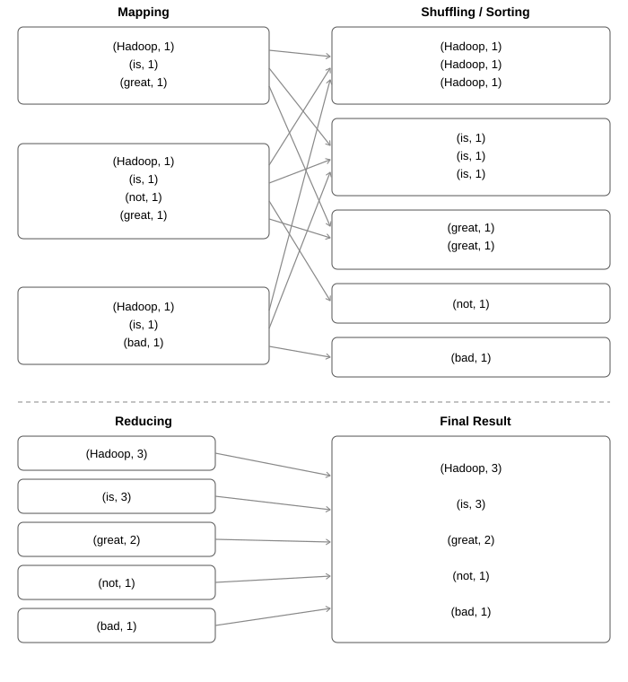

**Date:** 17/02/26

| Q. No. | 1 | 2 | 3 | 4 | 5 | 6 | 7 | 8 | 9 | 10 | 11 | 12 | Total Marks |
|-------|---|---|---|---|---|---|---|---|---|----|----|----|-------------|
| Mark Awarded | 10 | 10 | | | | | | | | | | | 20 |

---

<LongQuestion>
## Q1 (i) Explain Big Data characteristics and its types. Discuss about its challenges.
### (Awarded 5/5 marks)
</LongQuestion>

### (i) Big Data

Big Data consists of datasets that are not able to be handled by traditional tools, due to their size, speed of generation and complexity. They are generally in the range of Terabytes (TB) or Petabytes (PB).

**Types of Big Data — (3 types)**

**Structured Data:**
- It consists of data which is well-structured and defined in rows and columns.
- It can be queried using SQL language.
- It uses RDBMS (Relational Database Management System) as the data store.
- Eg: Employee records, Transaction information, etc.

**Unstructured Data:**
- It consists of data that does not have any well-defined structure.
- It cannot be queried using SQL.
- Since it is not well-defined, relationships cannot be formally defined.
- Eg: Videos, Images, Audio files, etc.

**Semi-Structured Data:**
- It consists of both structured and unstructured data.
- Commonly includes XML and JSON files which are often used in web applications.

**Challenges:**
- Since data is so large, it can only be stored on distributed systems; this increases the processing time.
- Because of a lack of structure, data cannot be cleaned and understood; this can lead to inaccuracies in data which affect the result of the analysis.
- It is more complex compared to traditional data.

**Characteristics:**

| # | V | Description |
|---|---|-------------|
| i | **Volume** | Refers to the amount of data. |
| ii | **Variety** | Big Data is generally a mixture of many types of data. |
| iii | **Velocity** | Refers to the speed at which data is generated. |
| iv | **Veracity** | Refers to the truthfulness or accuracy of data. |
| v | **Value** | The ability to extract meaningful insights from data. It is the most important. |

---

<LongQuestion>
## Q1 (ii) Explain Hadoop Ecosystem with core components.
### (Awarded 5/5 marks)
</LongQuestion>

### (ii) Hadoop

Hadoop is a framework of tools used to store and process Big Data. It is an open-source software managed by the Apache Foundation, and was created by Doug Cutting and Mike Cafarella.

**Core Components:**

**Hadoop Common:**
- Provides the shared utilities and libraries used by the Hadoop modules.

**YARN (Yet Another Resource Negotiator):**
- It is a Resource Manager which allocates CPU and memory to tasks.

**HDFS (Hadoop Distributed File System):**
- It is a scalable and fault-tolerant system for distributed data storage.
- It uses a master-slave architecture with 2 main components:
  - **i) NameNode:** It is the master entity, which stores metadata (file location, block permissions, etc.) of files.
  - **ii) DataNode:** It is the slave entity which actually stores data on local machines.
- It splits files into fixed-size data blocks (128 MB) and then stores them.

**MapReduce:**
- It is a programming model used to process Big Data.
- It has 2 main phases — Map phase and Reduce phase.
- It uses a Job Tracker (allocates tasks, manages execution) and a Task Tracker (actually carries out the map and reduce functions).

---

<LongQuestion>
## Q1 (iii) Differentiate traditional and big data business approach.
### (Awarded 5/5 marks)
</LongQuestion>

### (iii) Traditional Data vs. Big Data

| Aspect | Traditional Data | Big Data |
|--------|-----------------|----------|
| Size | Limited to GBs | Currently in TB or PB |
| Data Store | RDBMS | Does not use RDBMS; commonly Hadoop, Spark, etc. |
| Storage | Centralized storage | Distributed storage |
| Query Language | Uses SQL | Uses NoSQL, MapReduce, etc. |
| Data Generation | Generated per day or longer | Generated per second |
| Integration | Easy | Very complex |

---

<LongQuestion>
## Q2 (i) Explain the various stages of MapReduce with an example.
### (Awarded 5/5 marks)
</LongQuestion>

### (i) MapReduce Phases

MapReduce works in the following main phases:

**i) Input and Splitting:**
- The input data is split into fixed-size blocks (the last block can be smaller) for processing.

**ii) Map Phase:**
- The split data is mapped in the form of (key, value) pairs.

**iii) Shuffling / Sorting:**
- The (key, value) pairs are sorted according to key. This gives another list of intermediate key-value pairs.
- This increases the network traffic; hence a Combiner can also be used optionally as a mini-reducer to reduce the amount of data to be sent to the Reducer.

**iv) Reducer Phase:**
- It aggregates the intermediate key-value pairs and gives the final output.

---

**Example: Word Count Program**

**Input:**

```
Hadoop is great.
Hadoop is not great.
Hadoop is bad.
```

**Splitting:**

Each sentence is treated as a separate split:

```
→ Hadoop is great.
→ Hadoop is not great.
→ Hadoop is bad.
```

**Mapping** — each word emitted as (word, 1):

| Split | Map Output |
|-------|-----------|
| "Hadoop is great." | (Hadoop,1), (is,1), (great,1) |
| "Hadoop is not great." | (Hadoop,1), (is,1), (not,1), (great,1) |
| "Hadoop is bad." | (Hadoop,1), (is,1), (bad,1) |

**Shuffling / Sorting** — grouped by key:

```
(Hadoop,1), (Hadoop,1), (Hadoop,1)
(is,1), (is,1), (is,1)
(great,1), (great,1)
(not,1)
(bad,1)
```

**Reducing** — values summed per key:

```
(Hadoop, 3)
(is, 3)
(great, 2)
(not, 1)
(bad, 1)
```

**MapReduce Diagram (Word Count):**



*The diagram shows the Mapping stage (3 map boxes, one per input sentence) with crossing arrows into the Shuffling/Sorting stage (5 grouped boxes, one per unique word), followed by the Reducing stage and Final Result.*

---

<LongQuestion>
## Q2 (ii) Explain Matrix Vector Multiplication algorithm by MapReduce with an example.
### (Awarded 5/5 marks)
</LongQuestion>

### (ii) Matrix Multiplication with MapReduce

**Input split** — each element is represented as `(matrix, row, column, value)`:

```
(A, 0, 0, 2)
(A, 0, 1, 3)
(A, 1, 0, 0)
(A, 1, 1, 4)

(B, 0, 0, 5)
(B, 1, 0, 6)
(B, 0, 1, 7)
(B, 1, 1, 8)
```

**Mapping** — emits `(i, k) → (matrix, j, value)`:

```
(A, 0, 2)
(B, 0, 2)
(A, 0, 3)
(A, 1, 4)
(B, 0, 5)
(B, 1, 6)
(B, 0, 7)
(B, 1, 8)
```

**Reducing** — for each output cell `(i, k)`, the reducer multiplies matching A and B values on the shared dimension `j` and sums them to produce the final result matrix element `C[i][k]`.